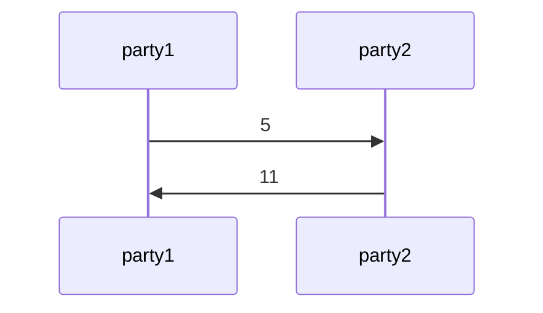

# PyChor: Choreographic Programming Library for Python

PyChor is a small Python library for writing choreographic programs: global
descriptions of distributed protocols that make party ownership, local
computation, and communication explicit.

Instead of writing one program per participant and matching up the sends and
receives by hand, you write the protocol once, from a global point of view.
Every value carries the set of parties that can see it, so a computation can
only happen where its inputs are available, and communication is written down
where it occurs.

📖 **[Documentation](https://uvm-plaid.github.io/pychor/)**

## Installation

```bash
pip install pychor
```

PyChor requires Python 3.9 or newer and has no required dependencies.

## Example

```python
import pychor

p1 = pychor.Party('party1')
p2 = pychor.Party('party2')

with pychor.LocalBackend(parties=[p1, p2]) as backend:
    x = 5 @ p1                       # 5@{party1}
    x.send(src=p1, dest=p2)          # 5@{party1, party2}

    z = 6 @ p2
    y = pychor.locally(lambda a, b: a + b, x, z)
    y.send(src=p2, dest=p1)          # 11@{party1, party2}

    backend.print_sequence_diagram()
```

`LocalBackend` records the protocol as a Mermaid sequence diagram as it runs:



## Backends

The choreography above never names a transport, so the same code runs under any
of three backends:

- **`LocalBackend`** — runs the whole choreography in one process, playing every
  party. For design, teaching, tests, and security experiments; the only backend
  that draws sequence diagrams.
- **`ForkingTCPBackend`** — forks one local process per party and connects them
  over TCP. Confirms a protocol is genuinely executable one-party-per-process.
- **`TCPBackend`** — one process per party across machines, for deployment.

See the [backends documentation](https://uvm-plaid.github.io/pychor/backends/)
for details and for writing your own.

## Examples

The `examples` directory contains working choreographies for real protocols —
hash commitments, oblivious transfer, Beaver-triple multiplication, GMW circuit
evaluation, and secure applications over private medical data — plus a
simulator-based security proof written as an executable experiment.

```bash
pip install -e ".[examples]"
cd examples
python run_tests.py
```

See the [examples documentation](https://uvm-plaid.github.io/pychor/examples/)
for a description of each one.

## Documentation

Install the documentation dependencies:

```bash
python -m pip install -e ".[docs]"
```

Preview the documentation locally:

```bash
mkdocs serve
```

Validate the static site before publishing:

```bash
mkdocs build --strict
```

Deploy the documentation manually to GitHub Pages:

```bash
mkdocs gh-deploy --clean
```

Configure GitHub Pages for the repository to publish from the `gh-pages` branch.
The generated `site/` directory is ignored on `main`; `mkdocs gh-deploy` builds
the site and pushes it to `gh-pages`.

## Acknowledgments

This material is based upon work supported by the National Science
Foundation under Grant No. 2238442. Any opinions, findings and
conclusions or recommendations expressed in this material are those of
the author(s) and do not necessarily reflect the views of the National
Science Foundation.
