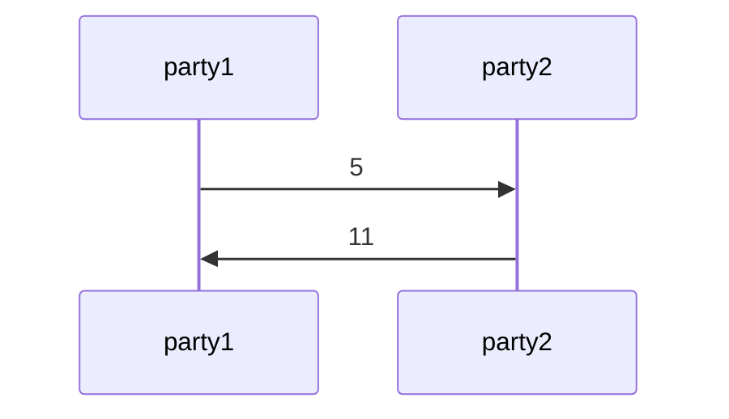

# Concepts

This page explains how PyChor actually executes a choreography. The
[tutorial](tutorial.md) shows the syntax; this page covers the rules that
decide where each computation runs and what each process knows, which is what
you need in order to move a protocol from `SimulationBackend` to a real
deployment.

## Located values

Every value in a choreography carries the set of parties that can see it. That
pairing is a `LocatedVal`: `val` is the underlying Python value and `parties` is
its owner set.

```python
with pychor.SimulationBackend(parties=[alice, bob]):
    x = 5 @ alice
    print(x)          # 5@{alice}
```

Ownership is not fixed. It **grows** when a value is communicated, because
after a send both parties know it:

```python
    x.send(src=alice, dest=bob)
    print(x)          # 5@{alice, bob}
```

Note that `send` modifies `x` in place rather than returning a new value: the
same object is now readable at both parties. Ownership **narrows** with `only`,
which returns a new located value restricted to a subset of the current owners:

```python
    print(x.only(bob))    # 5@{bob}
```

`only` communicates nothing and copies nothing. It is an assertion about *whose*
value you mean next, and the reason it matters is the rule in the following
section.

## Where a computation runs

A local computation runs at the parties that own **every** one of its located
inputs — the intersection of their owner sets — and its result is located at
exactly those parties.

```python
with pychor.SimulationBackend(parties=[alice, bob]):
    x = 5 @ alice                   # {alice}
    y = 6 @ bob                     # {bob}
    x.send(src=alice, dest=bob)     # x is now {alice, bob}

    z = pychor.locally(lambda a, b: a + b, x, y)
    print(z)                        # 11@{bob}
```

`x` is known to both parties and `y` only to `bob`, so the sum can only be
computed by `bob`, and that is where PyChor puts it. Had `x` not been sent
first, the intersection would have been empty and the call would have raised
`AssertionError: No participating parties`. An empty intersection is always an
error: it means the choreography asked someone to compute with data they do not
have.

Plain Python values may be mixed in freely and place no constraint of their own,
which is why `x + 1` works: the literal `1` is available everywhere, so the
result stays wherever `x` was.

This is where `only` earns its place. In `examples/protocol_ot.py`, the public
keys have been sent to the sender and so are owned by both parties, while the
options are owned by the sender alone:

```python
pub_keys.send(receiver, sender, note='public keys')
encrypted_options = encrypt_options(pub_keys, options)
```

The intersection of `{receiver, sender}` and `{sender}` is `{sender}`, so the
encryption happens at the sender — exactly once, in the right place, without
the choreography having to say so. When the intersection is *not* what you
want, narrow an input with `only`.

## Party sets are global; values are local

The single most important thing to understand before deploying a choreography is
which parts of it every process agrees on.

Under the TCP backends, all parties run the *same* program in separate
processes. Owner sets are derived from the program text, so every process
computes **identical** owner sets. The values are not: a `LocatedVal` holds the
real value only in the processes whose party owns it, and `None` everywhere
else.

That gives one rule with two consequences. A choreography may branch on
**ownership**:

```python
# examples/application_beaver.py — well defined
if p1 in val.parties:
    s2.send(p1, p2)
else:
    s1.send(p2, p1)
```

Every process evaluates that condition the same way, so they all take the same
branch and stay in step.

A choreography may **not** branch on data it might not own:

```python
# Deadlocks under a TCP backend
if x.val > 0:
    x.send(src=alice, dest=bob)
```

In the processes that do not own `x`, `x.val` is `None`, so they take the other
branch — and then the parties disagree about whether a message is coming. The
sender blocks on a write nobody reads, or the receiver blocks forever on a read.
To make a value available for a decision, send it to the parties that need to
decide.

!!! note "`SimulationBackend` will not catch this"
    A single process plays every party, so every value is genuinely present in
    memory and a data-dependent branch simply works. Running the protocol under
    `ForkingTCPBackend` is what surfaces the problem — this is the main reason
    that backend exists.

### Seeing it happen

`examples/protocol_simple.py` prints its located values as it goes, so running
it under a TCP backend shows the rule directly. Launching one process per party:

```bash
cd examples
ADDR="party1=127.0.0.1:11600,party2=127.0.0.1:11601"
PYCHOR_BACKEND=tcp PYCHOR_TCP_ME=party1 PYCHOR_TCP_ADDRESSES="$ADDR" python protocol_simple.py &
PYCHOR_BACKEND=tcp PYCHOR_TCP_ME=party2 PYCHOR_TCP_ADDRESSES="$ADDR" python protocol_simple.py
```

Each process prints its own picture of the same four values:

=== "party1's process"

    ```
    x 5@{party1}
    x 5@{party2, party1}
    y None@{party2}
    y 11@{party2, party1}
    ```

=== "party2's process"

    ```
    x None@{party1}
    x 5@{party2, party1}
    y 11@{party2}
    y 11@{party2, party1}
    ```

The owner sets are identical line for line — both processes agree completely
about who knows what. The values are not. `x` starts as `5` for party1 and
`None` for party2; the sum `y` is computed at party2, so party1 holds `None`
for it until it is sent back. Ownership is common knowledge; data is not.

## One active backend at a time

PyChor tracks the active backend in a module-level global that
`ChoreographyBackend.__enter__` installs and `__exit__` clears. Two things
follow:

- Backends do not nest, and only one may be active at a time. Operations
  outside any backend context raise
  `AssertionError: No PyChor backend is running` — except a
  [`local_function`](api.md#pychor.choreography.local_function), which
  deliberately falls back to plain Python so helpers stay testable on their own.
- Located values do not outlive their `with` block. Read whatever you need out
  of a choreography before the context exits.

Re-entering a backend gives a fresh run with empty views, which is how
`examples/protocol_sum.py` samples a protocol repeatedly.

## Sequence diagrams

`SimulationBackend` records every send as it happens and accumulates a
[Mermaid](https://mermaid.js.org/) sequence diagram in its `uml` attribute.
`print_sequence_diagram()` prints it:

```python
with pychor.SimulationBackend(parties=[p1, p2]) as backend:
    x = 5 @ p1
    x.send(src=p1, dest=p2)
    z = 6 @ p2
    y = pychor.locally(lambda a, b: a + b, x, z)
    y.send(src=p2, dest=p1)

    backend.print_sequence_diagram()
```

That produces the following diagram source, which renders directly in any
Mermaid-aware Markdown:



Values longer than ten characters are abbreviated with an ellipsis in the
diagram — a share or a ciphertext would otherwise swamp it. The value actually
delivered is never truncated.

For protocols where the payload is opaque anyway, label the message instead of
showing it. `send` takes a `note`, which is appended to the edge:

```python
# examples/protocol_commit.py
self.hash_val.send(sender, receiver, note='hash of committed value')
```

You can also add Mermaid directives of your own with
`emit_to_sequence`, which appends a raw line to the diagram.

## Execution timing

`SimulationBackend` also gives every party a virtual clock, so a protocol's
communication rounds and local work show up as time. Clocks start at zero and
advance in two ways:

- **Sends.** When `a` sends to `b`, `b`'s clock becomes the later of its
  current time and `a`'s time plus the latency of the link. A party that is
  behind waits for the message; a party that is already ahead is not delayed.
  The sender's clock does not change.
- **Local computations.** `locally` — and the operators built on it — times the
  function as it runs and adds the elapsed time to the clock of every party
  that owns the result, since each of them would run it in a real deployment.

The latency model is the `latency` argument to `SimulationBackend`. It can be a
constant number of seconds for every pair of parties (the default is `0.1`, a
wide-area 100 ms), a mapping from `(sender, receiver)` pairs to seconds that
covers every ordered pair of distinct parties, or a callable
`(sender, receiver) -> seconds`:

```python
def latency(sender, receiver):
    return 0.1 if dealer in (sender, receiver) else 0.001   # WAN to the dealer, LAN otherwise

with pychor.SimulationBackend(parties=[p1, p2, dealer], latency=latency) as backend:
    ...
    backend.print_timing_summary()
```

`print_timing_summary()` prints one row per party with its final clock, the
compute and waiting time that make it up, and its message counts, followed by
the *makespan* — the largest clock, which is how long the protocol took. For
the choreography in the [sequence diagram](#sequence-diagrams) section:

```
==================================================
Execution Timing:
latency model: constant 0.1 s per message
party      clock (s)   compute (s)      wait (s)  local ops   sent  received
party1      0.200000      0.000000      0.200000          0      1         1
party2      0.100004      0.000004      0.100000          1      1         1
makespan: 0.200000 s (party1)
==================================================
```

The same numbers are available programmatically as
[`PartyTiming`](api.md#pychor.choreography.PartyTiming) objects in
`backend.timing`, keyed by party. Latency is a model, but compute time is a
measurement: it is the wall-clock time the simulating process spent in each
local function, so it varies from run to run and machine to machine, and it
reflects one process doing everyone's work rather than each party's own
hardware.

## Views and security proofs

A party's **view** is the ordered list of message payloads it has received.
Backends record it as they deliver messages, and it is readable either from the
backend or from the party:

```python
with backend(parties=[receiver, sender]) as b:
    result = ot(sender, receiver, select_bits, options)

    for party, messages in b.views.items():
        print(party)
        for message in messages:
            print('  ' + str(message))
```

Views are more than a debugging aid: a view is precisely the object that a
simulation-based security proof reasons about. A protocol is private with
respect to a party if everything that party sees could have been produced
without access to the honest inputs — that is, if a *simulator* with no secrets
can generate a view indistinguishable from the real one.

`examples/protocol_sum.py` carries out that argument as an executable
experiment, and the workflow is worth copying:

1. Write the protocol (`protocol_sum`).
2. Write the ideal functionality it is supposed to implement
   (`functionality_sum`) — a trusted third party that simply collects the
   inputs and returns the answer.
3. Write simulator hybrids (`sim_sum_hybrid1` … `sim_sum_hybrid3`), each a step
   further from the real protocol and closer to the ideal one.
4. Run each in its own backend context and collect `p1.view()`.
5. Compare the distributions of real and simulated views across many runs.

Because each `with` block starts with empty views, sampling means re-entering
the backend once per run:

```python
simulator_results = []
for _ in range(num_runs):
    with backend(parties=[p1, p2, Fsum]):
        in1 = 5@p1
        in2 = 3@p2
        sim_sum_hybrid3(in1, functionality_result)
        simulator_results.append(np.array(p1.view()))
```

The example then checks that the messages a party receives are uniformly
distributed and mutually uncorrelated — a chi-square test and a Spearman
correlation — for both the protocol and the simulator. Agreement between the two
is empirical evidence for the security argument, and a disagreement points at
the step of the protocol that leaks.

Under a TCP backend, each process can only see its own party's view, since the
other parties' messages never arrive in that process. Collecting all views at
once is a `SimulationBackend` capability.
